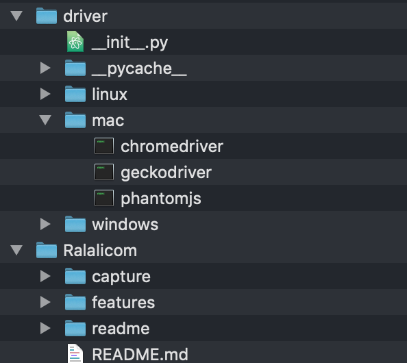

[](https://www.python.org/)
[](http://www.seleniumhq.org/)
[](https://behave.readthedocs.io/en/latest/)
[](http://chromedriver.chromium.org/downloads)
[](https://github.com/mozilla/geckodriver/releases)

# Automation Test Ralali.com
Automation test aplikasi e-commerce Ralali.com menggunakan behave untuk kerangka pengujian (testing framework), dan gherkin yang merupakan bahasa bisnis yang digunakan untuk menulis tes dengan cara yang mudah dibaca oleh manusia, serta bahasa pemrograman python untuk penulisan script fungsi. Ralali, Online B2B Marketplace yang memberikan kemudahan proses transaksi jual-beli melalui teknologi dan fitur yang dapat membantu Seller dan Buyer melakukan proses bisnis lebih mudah, aman, dan transparan.

# Requirements
- Python 3.7.1
- Behave
- Selenium Webdriver
- Browser Chrome or ChromeDriver
- Browser Firefox or GeckoDriver

# OS
- macOS Mojave 10.14 (already tested)
- Linux
- Windows

# How to Use
- Download (zip) atau git pull project automation test
- Buka terminal
- Masuk ke directory project
- Check versi python (Minimal versi python 3) ```$ python3 --version```, atau dan lakukan update versi bisa download [disini](https://www.python.org/downloads/)
- Buat virtual enviroment untuk project ```$ virtualenv -p python3 <namafoldervirtual>```
- Aktifkan folder virtual enviroment ``$ source <namafoldervirtual>/bin/activate```
- Check library dan framework yang sudah terinstall pada virtual enviroment (before)
- Install kebutuhan library dan framework untuk project
- Install behave, selenium webdriver, atau bisa install menggunakan file requirements.txt
- Check library dan framework yang sudah terinstall pada virtual enviroment (after)
- Ketik perintah ```$ behave``` pada terminal untuk run semua file scenario test
- Ketik perintah ```$ behave -i features/[nama file].feature``` untuk run 1 file scenario test
- Ketik perintah ```$ behave -f steps --dry-run features/``` untuk melihat semua format scenario test dan step definitions
- Ketik perintah ```$ behave --dry-run``` untuk melihat semua scenario test pada file .feature
- Untuk deactive virtualenv ```$ deactivate```

# Create Scenario Test (.feature)
- Buat file didalam folder features/ dengan format [nama file].feature
- Ketik perintah $ behave -f steps --dry-run features/ untuk melihat semua format scenario test yang bisa digunakan
- Format penulisan scenario

```gherkin
Feature: Login

  Scenario: Login Invalid
    Given I navigate to "https://ralali.com/"
    When I click Login

  Scenario: Login Valid
    Given ...
```

- Kemudian run dengan ketik ```$ behave -i features/[nama file].feature``` file tersebut

## Configuration
###### Browser
- Buka file browser.py didalam folder features/
- Download ChromeDriver [disini](http://chromedriver.chromium.org/downloads)
- Download GeckoDriver [disini](https://github.com/mozilla/geckodriver/releases)
- Buat folder diluar project driver/



###### Enviroment
- Buka file enviroment.py didalam folder features/
